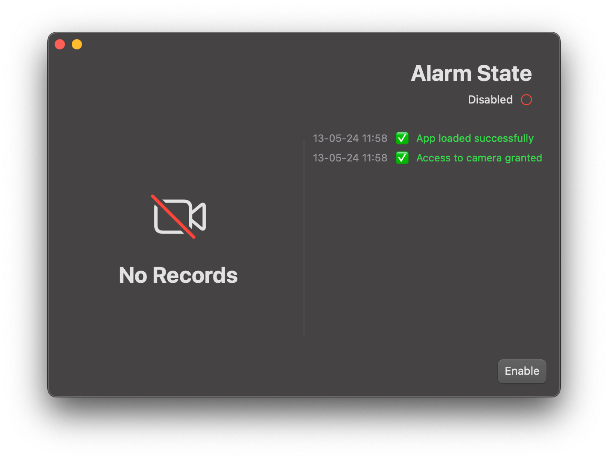
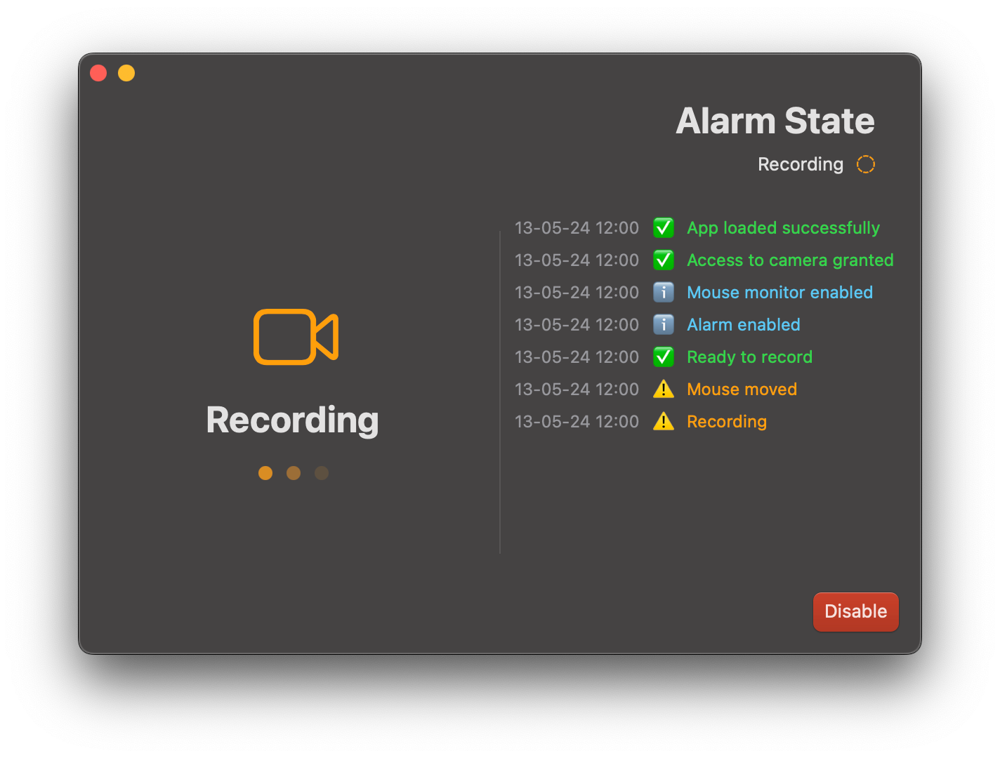

# SafeLock


> Version: **1.0.2**

---

## Table of Contents

- [About](#about)
- [Requirements](#requirements)
- [Installation](#installation)
- [Usage](#usage)
- [Changelog](#changelog)
- [Contributing](#contributing)
- [License](#license)
- [Authors](#authors)

## About

Welcome to SafeLock, a macOS app designed to enhance your screen security. SafeLock not only locks your screen but also features a unique capability: it records with your webcam if any movement is detected. This added layer of security ensures that your device remains protected from unauthorized access.

## Requirements

- macOS 10.15 or later
- FFMPEG must be installed on your system.

```bash
brew install ffmpeg
```

## Installation

1. Download the latest release from the [Releases](https://github.com/Zarox28/SafeLock/releases/latest) page.

2. Install FFMPEG if you haven't already with homebrew by running the following command:

```bash
brew install ffmpeg
```

3. Open the downloaded `.dmg` file and drag the `SafeLock.app` to your Applications folder.

4. Open `SafeLock.app` from your Applications folder.

5. Allow SafeLock to access your camera.

## Usage

1. Open `SafeLock.app`.



2. Click on the `enable` button to start the screen lock.

3. To disable the screen lock, click on the `disable` button.



## Changelog

See [CHANGELOG.md](CHANGELOG.md) for latest changes.

## Contributing

Contributing is disabled for this repository.

## License

This project is licensed under the AGPL v3 License - see the [LICENSE.md](LICENSE.md) file for details.

## Authors

- **[@Zarox28](https://github.com/Zarox28)**
